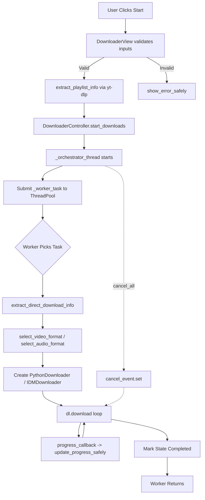

```mermaid
flowchart TD
    Start[User Clicks Start] --> Validate[DownloaderView validates inputs]
    Validate -->|Valid| ExtractList[extract_playlist_info via yt-dlp]
    Validate -->|Invalid| ShowErr[show_error_safely]
    ExtractList --> Controller[DownloaderController.start_downloads]
    Controller --> Orchestrator[_orchestrator_thread starts]
    Orchestrator --> SubmitWorkers[Submit _worker_task to ThreadPool]
    SubmitWorkers --> WorkerActive{Worker Picks Task}
    WorkerActive --> ExtractVid[extract_direct_download_info]
    ExtractVid --> SelFormat[select_video_format / select_audio_format]
    SelFormat --> InstantiateDL[Create PythonDownloader / IDMDownloader]
    InstantiateDL --> DownloadChunk[dl.download loop]
    DownloadChunk --> UpdateView[progress_callback -> update_progress_safely]
    UpdateView --> DownloadChunk
    DownloadChunk --> Complete[Mark State Completed]
    Complete --> End[Worker Returns]
    
    Orchestrator -.-> |cancel_all| CancelEvent[cancel_event.set]
    CancelEvent -.-> DownloadChunk
```

