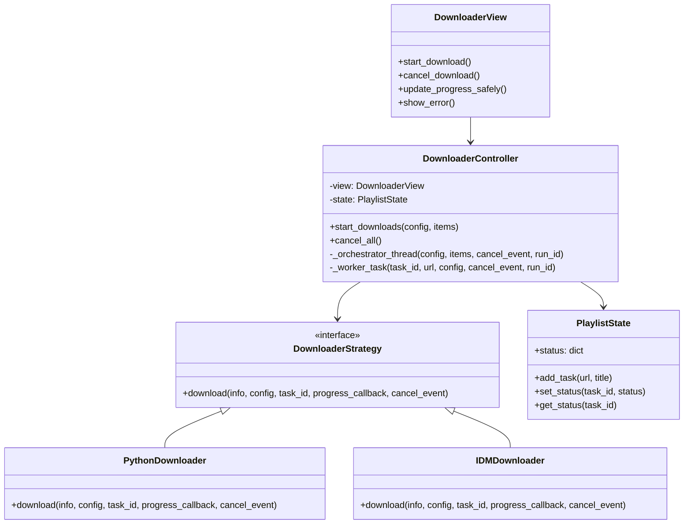

```mermaid
classDiagram
    class DownloaderView {
        +start_download()
        +cancel_download()
        +update_progress_safely()
        +show_error()
    }
    class DownloaderController {
        -view: DownloaderView
        -state: PlaylistState
        +start_downloads(config, items)
        +cancel_all()
        -_orchestrator_thread(config, items, cancel_event, run_id)
        -_worker_task(task_id, url, config, cancel_event, run_id)
    }
    class DownloaderStrategy {
        <<interface>>
        +download(info, config, task_id, progress_callback, cancel_event)
    }
    class PythonDownloader {
        +download(info, config, task_id, progress_callback, cancel_event)
    }
    class IDMDownloader {
        +download(info, config, task_id, progress_callback, cancel_event)
    }
    class PlaylistState {
        +status: dict
        +add_task(url, title)
        +set_status(task_id, status)
        +get_status(task_id)
    }
    DownloaderView --> DownloaderController
    DownloaderController --> DownloaderStrategy
    DownloaderStrategy <|-- PythonDownloader
    DownloaderStrategy <|-- IDMDownloader
    DownloaderController --> PlaylistState
```