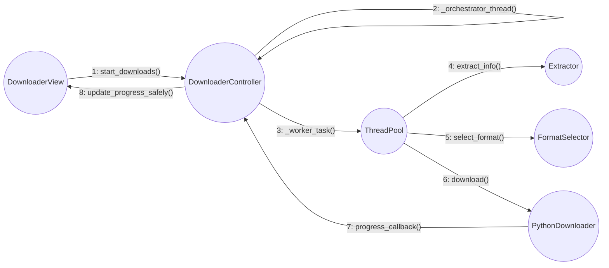

```mermaid
flowchart LR
    UI((DownloaderView)) -- "1: start_downloads()" --> Ctrl((DownloaderController))
    Ctrl -- "2: _orchestrator_thread()" --> Ctrl
    Ctrl -- "3: _worker_task()" --> Worker((ThreadPool))
    Worker -- "4: extract_info()" --> Ext((Extractor))
    Worker -- "5: select_format()" --> Form((FormatSelector))
    Worker -- "6: download()" --> DL((PythonDownloader))
    DL -- "7: progress_callback()" --> Ctrl
    Ctrl -- "8: update_progress_safely()" --> UI
```

