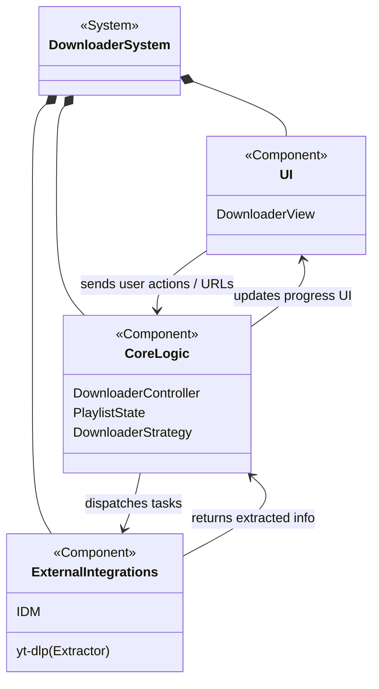

```mermaid
classDiagram
    class DownloaderSystem {
        <<System>>
    }
    class UI {
        <<Component>>
        DownloaderView
    }
    class CoreLogic {
        <<Component>>
        DownloaderController
        PlaylistState
        DownloaderStrategy
    }
    class ExternalIntegrations {
        <<Component>>
        yt-dlp (Extractor)
        IDM
    }
    
    %% Composition links
    DownloaderSystem *-- UI
    DownloaderSystem *-- CoreLogic
    DownloaderSystem *-- ExternalIntegrations
    
    %% Explicit Internal Connectors (Delegation/Data Flow)
    UI --> CoreLogic : sends user actions / URLs
    CoreLogic --> UI : updates progress UI
    CoreLogic --> ExternalIntegrations : dispatches tasks
    ExternalIntegrations --> CoreLogic : returns extracted info
```
