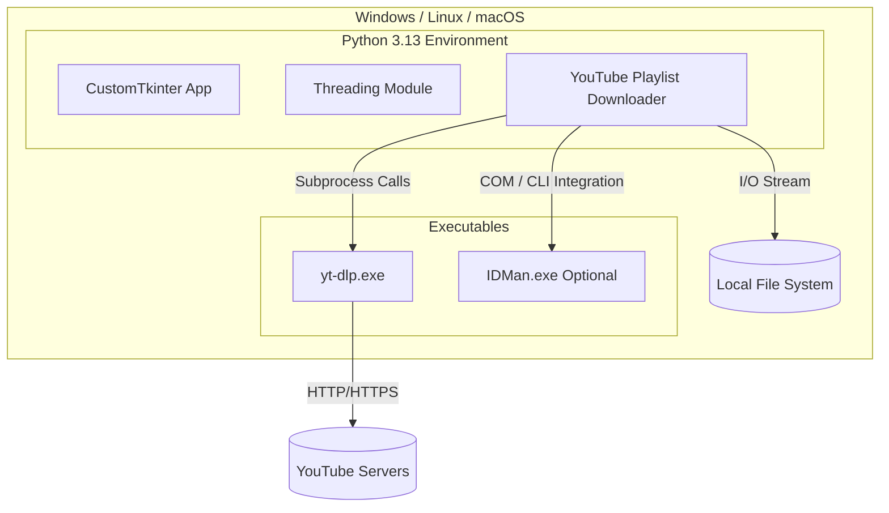

```mermaid
flowchart TB
    subgraph Host OS [Windows / Linux / macOS]
        subgraph Python Runtime [Python 3.13 Environment]
            GUI[CustomTkinter App]
            Orchestrator[Threading Module]
            AppLogic[YouTube Playlist Downloader]
        end
        
        subgraph Executables
            YTDLP[yt-dlp.exe]
            IDM[IDMan.exe Optional]
        end
        
        Disk[(Local File System)]
    end
    
    AppLogic -- "Subprocess Calls" --> YTDLP
    AppLogic -- "COM / CLI Integration" --> IDM
    AppLogic -- "I/O Stream" --> Disk
    YTDLP -- "HTTP/HTTPS" --> YouTube[(YouTube Servers)]
```