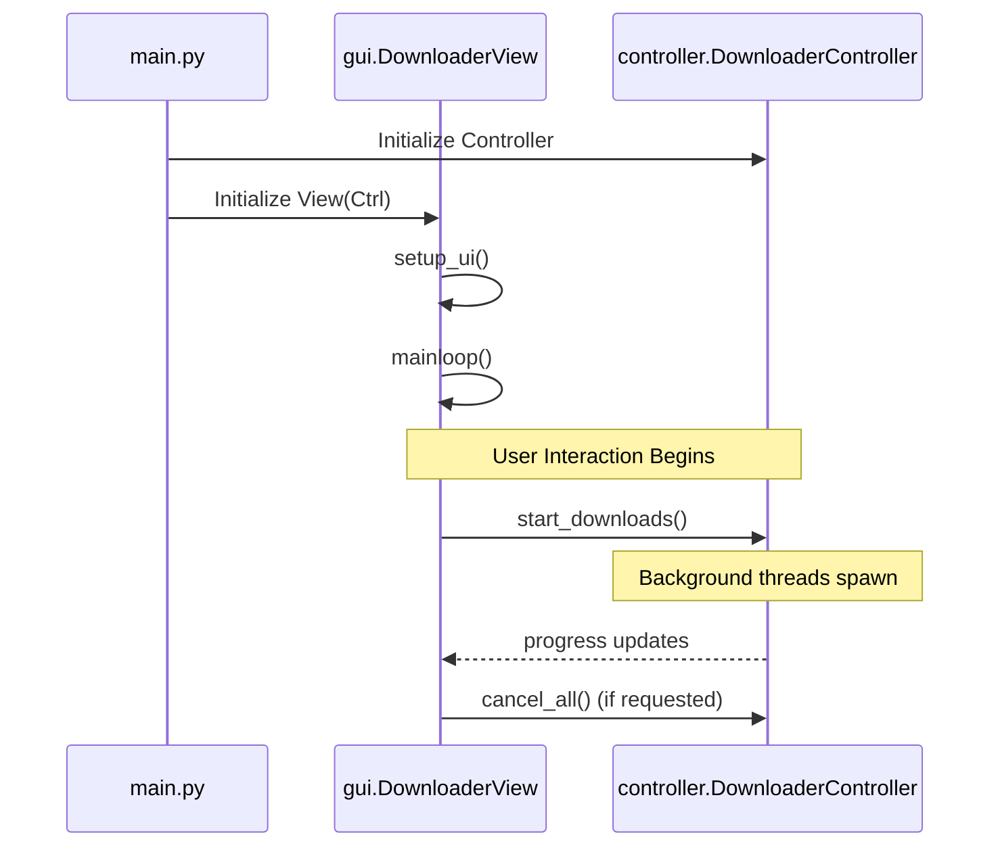

```mermaid
sequenceDiagram
    participant App as main.py
    participant View as gui.DownloaderView
    participant Ctrl as controller.DownloaderController
    
    App->>Ctrl: Initialize Controller
    App->>View: Initialize View(Ctrl)
    View->>View: setup_ui()
    View->>View: mainloop()
    
    note over View, Ctrl: User Interaction Begins
    View->>Ctrl: start_downloads()
    note over Ctrl: Background threads spawn
    Ctrl-->>View: progress updates
    View->>Ctrl: cancel_all() (if requested)
```

