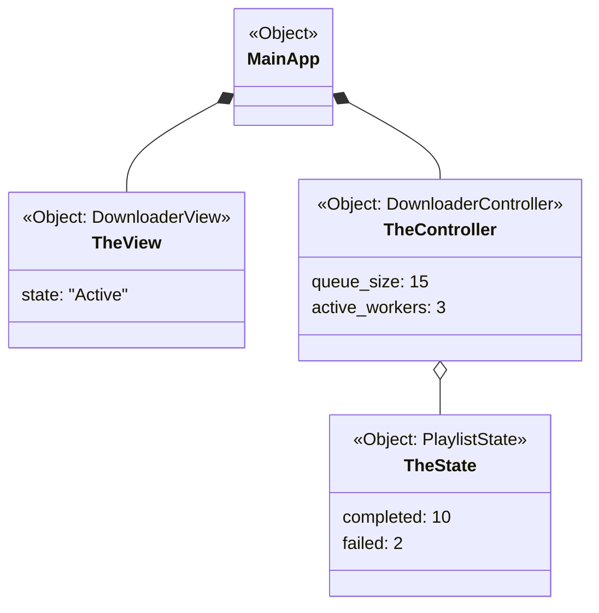

```mermaid
classDiagram
    class MainApp {
        <<Object>>
    }
    class TheView {
        <<Object: DownloaderView>>
        state: "Active"
    }
    class TheController {
        <<Object: DownloaderController>>
        queue_size: 15
        active_workers: 3
    }
    class TheState {
        <<Object: PlaylistState>>
        completed: 10
        failed: 2
    }
    MainApp *-- TheView
    MainApp *-- TheController
    TheController o-- TheState
```

