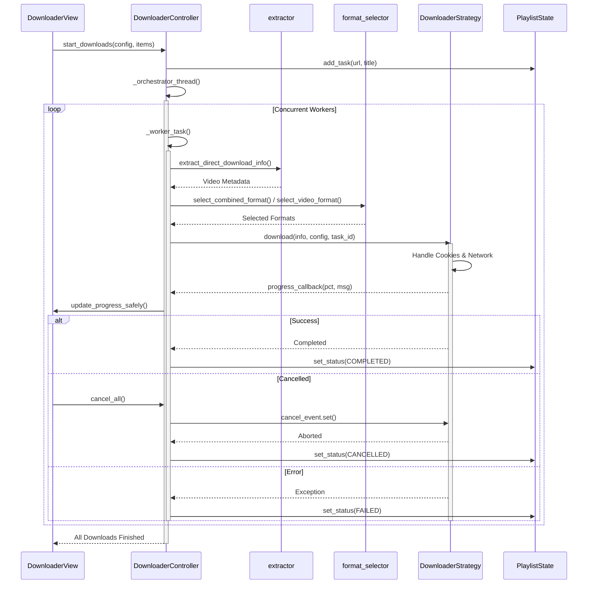

```mermaid
sequenceDiagram
    participant UI as DownloaderView
    participant Ctrl as DownloaderController
    participant Ext as extractor
    participant FS as format_selector
    participant DL as DownloaderStrategy
    participant State as PlaylistState

    UI->>Ctrl: start_downloads(config, items)
    Ctrl->>State: add_task(url, title)
    Ctrl->>Ctrl: _orchestrator_thread()
    activate Ctrl
    
    loop Concurrent Workers
        Ctrl->>Ctrl: _worker_task()
        activate Ctrl
        Ctrl->>Ext: extract_direct_download_info()
        Ext-->>Ctrl: Video Metadata
        Ctrl->>FS: select_combined_format() / select_video_format()
        FS-->>Ctrl: Selected Formats
        
        Ctrl->>DL: download(info, config, task_id)
        activate DL
        DL->>DL: Handle Cookies & Network
        DL-->>Ctrl: progress_callback(pct, msg)
        Ctrl->>UI: update_progress_safely()
        
        alt Success
            DL-->>Ctrl: Completed
            Ctrl->>State: set_status(COMPLETED)
        else Cancelled
            UI->>Ctrl: cancel_all()
            Ctrl->>DL: cancel_event.set()
            DL-->>Ctrl: Aborted
            Ctrl->>State: set_status(CANCELLED)
        else Error
            DL-->>Ctrl: Exception
            Ctrl->>State: set_status(FAILED)
        end
        deactivate DL
        deactivate Ctrl
    end
    Ctrl-->>UI: All Downloads Finished
    deactivate Ctrl
```