# Downloader Timing Diagram

*This timing profile shows the estimated execution runtime for processing a single video and audio stream in parallel.*

**Legend & Metrics:**
- **Setup & Orchestration**: GUI interaction, orchestrator thread initialization, and thread pool allocation (approx. 4 seconds).
- **Worker 1 (Video)**: Extractor directly fetches video stream info and `PythonDownloader` fetches chunks (approx. 16 seconds total).
- **Worker 2 (Audio)**: Runs concurrently, fetching audio info and utilizing `IDMDownloader` (approx. 11 seconds total).
- *Note: Measured runtime depends on user bandwidth and YouTube API rate limits. Timings below are for a typical 1080p scenario (100MB).*

```mermaid
gantt
    title Video/Audio Parallel Download Timing Profile (Estimated)
    dateFormat  s
    axisFormat %S
    
    section Setup & Orchestrator
    GUI Validation & yt-dlp hook (est. 2s) : 0, 2s
    _orchestrator_thread init (est. 1s)    : 2, 3s
    ThreadPool Allocation (est. 1s)        : 3, 4s
    
    section Worker 1 (Video)
    extract_video_info (est. 4s)           : 4, 8s
    select_video_format (est. 1s)          : 8, 9s
    PythonDownloader.download (est. 11s)   : 9, 20s
    
    section Worker 2 (Audio)
    extract_audio_info (est. 4s)           : 5, 9s
    select_audio_format (est. 1s)          : 9, 10s
    IDMDownloader.download (est. 6s)       : 10, 16s
```

